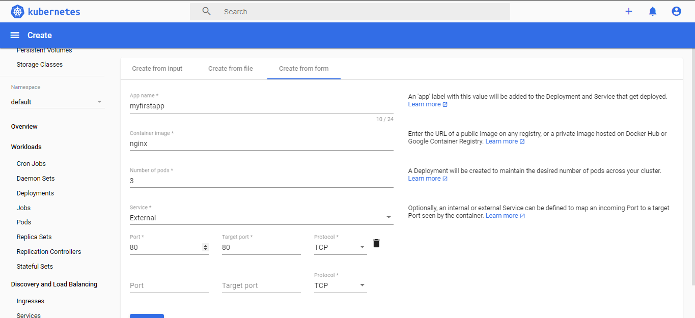
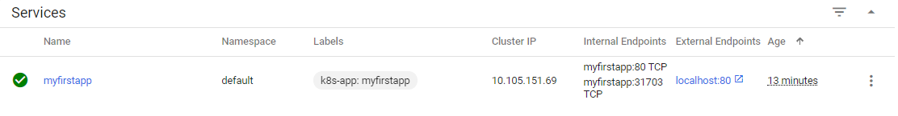

<h1 align="center">
  <br>
  <a></a>
  <br>
  Hello Kubernetes
  <br>
</h1>
It is an open source system which helps in creating and managing containerization of application.
It allows you to deploy and manage multi-container applications at scale. While in practice Kubernetes is most often used with Docker, the most popular containerization platform.</br> 
This tutorial provides an overview of different kind of features and functionalities of Kubernetes.


## Table of Contents
* [What is Container Orchestration](#what-is-container-orchestration)
* [Why do we need Container Orchestration](#why-do-we-need-container-orchestration)
* [Prerequisites](#prerequisites)
* [Installation](#installation)
* [Kuberneter Dashboard](#kuberneter-dashboard)


## What is Container Orchestration
Container orchestration is the automated arrangement, coordination and management of containers in their clusters.</br>
Its is an automation of all aspects of coordinating and managing containers.</br>
Kubernetes provides features of auto-replication, auto-scaling, auto-healing, volume management, networking.


## Why do we need Container Orchestration
Container orchestration is used to automate the following task in individual containers among the mircoservice ecosystem:
* High Availablity of Containers
* Configuration and Scheduling of Containers
* Dynamic allocation of resources among Containers
* Autoscaling of Containers
* Load balancing, traffic routing and service discovery of Containers
* Securing communication in between the Containers


## Prerequisites
One who wants to understand Kubernetes should have an understating of how the Docker works, how the Docker images are created, and how they work as a standalone unit. it would help if the readers have some exposure to Linux.


## Installation
To work on kubernetes, Docker must be install on the machine. This installation is done targeting Windows OS.</br>
The following steps for Installation:

* Download and Install Docker Desktop for Windows [Installation Guide](https://docs.docker.com/docker-for-windows/install/)
* Start Docker Desktop 
* Start Kubernetes by enabling Kubernetes

 <a></a>

### Download Kubectl for Windows
Run below command from windows powershell
```
$ curl -LO https://storage.googleapis.com/kubernetes-release/release/v1.18.0/bin/windows/amd64/kubectl.exe
```
It will download a kubectl.exe file place it any where on your machine directory.
Add the binary in to your PATH.(Env Variable)

Test to ensure the version of kubectl is the same as downloaded:
```
$ kubectl version --client
```


## Kubernetes Dashboard
Create File user.yml 
```
$ nodepad user.yml
```
Paste the content below 
```
apiVersion: v1
kind: ServiceAccount
metadata:
  name: admin-user
  namespace: kube-system
```
To apply the changes:
```
kubectl apply -f user.yml
```


Create role.yml
```
$ nodepad role.yml
```
Paste the content below
```
apiVersion: rbac.authorization.k8s.io/v1
kind: ClusterRoleBinding
metadata:
  name: admin-user
roleRef:
  apiGroup: rbac.authorization.k8s.io
  kind: ClusterRole
  name: cluster-admin
subjects:
- kind: ServiceAccount
  name: admin-user
  namespace: kube-system
```

To apply the changes:
```
kubectl apply -f role.yml
```
To get system Kubectl Secret Token 
```
$ kubectl -n kube-system get secret | findstr admin-user
```

To get the token password to login Kubernetes Dashboard
```
 $ kubectl -n kube-system describe secret <Token from above command>
```
> Copy and keep the output token from above command safe in text file for logging into Dashboard

To Download Dashboard
```
kubectl apply -f https://raw.githubusercontent.com/kubernetes/dashboard/v2.0.0-beta8/aio/deploy/recommended.yaml
```

If you like charts and graphs so also add these as well:
```
$ kubectl create -f https://raw.githubusercontent.com/kubernetes/heapster/master/deploy/kube-config/influxdb/influxdb.yaml
$ kubectl create -f https://raw.githubusercontent.com/kubernetes/heapster/master/deploy/kube-config/influxdb/heapster.yaml
$ kubectl create -f https://raw.githubusercontent.com/kubernetes/heapster/master/deploy/kube-config/influxdb/grafana.yaml
```

Start K8s Dashboard
```
$ kubectl proxy
```

Open the Link below: </br>
http://localhost:8001/api/v1/namespaces/kubernetes-dashboard/services/https:kubernetes-dashboard:/proxy/#/login
> Use the saved token to login

<a></a>

### Kuberneters Dashboard Page
<a></a>

**Check Kubernetes Pods**
```
$ kubectl get nodes
```
```
NAME             STATUS   ROLES    AGE    VERSION
docker-desktop   Ready    master   4d5h   v1.16.6-beta.0
```
Here one master node will be up and running

### Cluster Roles
There are 60 Roles available for K8s Dashboard to access, you can assign in above role.yml while making it up.

### Kube Namespaces
Logical segregation of application, you can segregate on the basis of teams or application in your organization.
```
$ kubectl get pods
```
> No resources found in default namespace.
```
$ kubectl get pods -n kube-system

NAME                                     READY   STATUS    RESTARTS   AGE
coredns-5644d7b6d9-6jrbs                 1/1     Running   0          4d6h
coredns-5644d7b6d9-nbwxl                 1/1     Running   0          4d6h
etcd-docker-desktop                      1/1     Running   0          4d6h
kube-apiserver-docker-desktop            1/1     Running   0          4d6h
kube-controller-manager-docker-desktop   1/1     Running   1          4d6h
kube-proxy-cst4f                         1/1     Running   0          4d6h
kube-scheduler-docker-desktop            1/1     Running   0          4d6h
storage-provisioner                      1/1     Running   0          4d6h
vpnkit-controller                        1/1     Running   0          4d6h
```
> Above you can see in the namespace **kube-system** these multipe pods are running.\
> **Note :** By default if you not specify anything it will go into **default** namespace.

### Nodes
Inside Nodes section you can check all node system level information i.e CPU, Memory Utilization, Resource Information and Node Condition.

<a></a>

### Persistent Volume
A Volume is a directory which is accessible to the containers in a pod.
You can attach persisting volume to your container.

The volumes that are created through Kubernetes is not limited to any container. It supports any or all the containers deployed inside the pod of Kubernetes. A key advantage of Kubernetes volume is, it supports different kind of storage wherein the pod can use multiple of them at the same time.

### Storage Classes
A StorageClass provides a way for administrators to describe the “classes” of storage they offer. Different classes might map to quality-of-service levels, or to backup policies, or to arbitrary policies determined by the cluster administrators.

### Daemon Set
Let's say whenever we add a node in the cluster and want few containers to be pre loaded Deamon set does it for you.
* running a cluster storage daemon on every node
* running a logs collection daemon on every node
* running a node monitoring daemon on every node

### Deployements
A deployment is a supervisor for pods, giving you fine-grained control over how and when a new pod version is rolled out as well as rolled back to a previous state.

In Kubernetes there are a few different ways to release an application, it is necessary to choose the right strategy to make your infrastructure reliable during an application update few of them are below.

* recreate: terminate the old version and release the new one
* ramped: release a new version on a rolling update fashion, one after the other
* blue/green: release a new version alongside the old version then switch traffic
* canary: release a new version to a subset of users, then proceed to a full rollout

### Replica Sets
This is responsible to ensure n number of pod should be running in the perticular deployment.
> In kube-system namespace you can see for a deployment the replica sets are pointing to 2, Here 2 pods are running.

<a></a>

**Exercise**
```
ecdd3f31267c        bf261d157914             "/coredns -conf /etc…"   28 minutes ago      Up 27 minutes                           k8s_coredns_coredns-5644d7b6d9-nbwxl_kube-system_9b85f34b-38fa-4b3b-b7bc-dfeb0add6306_0
```
If I delete this one of the coredns pod manually it should bring it up again to maintain 2 replica sets.\
Now If I do **docker ps** again , you'll see the coredns is brought up again.
```
964626fe7a76        bf261d157914             "/coredns -conf /etc…"   23 seconds ago      Up 19 seconds                           k8s_coredns_coredns-5644d7b6d9-nbwxl_kube-system_9b85f34b-38fa-4b3b-b7bc-dfeb0add6306_1
```

### Kuberneters Jobs
A job in Kubernetes is a supervisor for pods carrying out batch processes, that is a process that runs for a certain time to completion.

### Pods
A pod is a collection of containers sharing a network and mount namespace and is the basic unit of deployment in Kubernetes. All containers in a pod are scheduled on the same node.

<a></a>

### Service
It can be defined as an abstraction on the top of the pod which provides a single IP address and DNS name by which pods can be accessed.
A Service enables network access to a set of Pods in Kubernetes.\
Service is able to be accessed from 4 types:

* ClusterIP – The default value. The service is only accessible from within the Kubernetes cluster – you can’t make requests to your Pods from outside the cluster!
* NodePort – This makes the service accessible on a static port on each Node in the cluster. This means that the service can handle requests that originate from outside the cluster.
* LoadBalancer – The service becomes accessible externally through a cloud provider's load balancer functionality. GCP, AWS, Azure, and OpenStack offer this functionality. The cloud provider will create a load balancer, which then automatically routes requests to your Kubernetes Service

### Ingress
An Ingress is an object that allows access to your Kubernetes services from outside the Kubernetes cluster. You configure access by creating a collection of rules that define which inbound connections reach which services.
<h1 align="center">
<a></a>
</h1>

### ConfigMap
ConfigMap is configuration key-value pain in the form of storage in K8s. It keeps the confiuration seperate from your application.\
It is used for Store connection strings, public credentials, hostnames, and URLs.

You can have multiple ConfigMaps, one for each environment.

### Persistent Volume
Data in that volume and file system will be destroyed when the pod is restarted. To solve this Persistent volume , Persistent volumes are long-term storage in your Kubernetes cluster.

## Secrets
Secrets can be defined as Kubernetes objects used to store sensitive data such as user name and passwords with encryption.\
Two ways to create secrets are .txt and .yaml files

### Myfirstapp
Creating a first deployment manually from the Dashboard, You can create the resource by clicking on the right top plus icon the K8s dashboard.
<a></a>
Here we made an deployemnt for ngnix where we have assigned 3 pods to it and service as external.
<a></a>
Above you'll get and external endpoint to access your app in services


### Create Resources using YAML
```
# What is the version of your resource?
apiVersion: apps/v1

# What kind of resource you want ? Deployment
kind: Deployment
metadata:
  name: nginx-deployment
  labels:
    app: nginx
 # A deployment's specification really only 
 # has a few useful options    
spec:
# A deployment's specification really only 
# has a few useful options   
 
# 1. How many copies of each pod do we want?
  replicas: 4
  
# 3. Which pods are managed by this deployment?  
  selector:
  
# This must match the labels we set on the pod!  
    matchLabels:
      app: nginx

# This template field is a regular pod configuration 
# nested inside the deployment spec      
  template:
    metadata:
# Set labels on the pod.
# This is used in the deployment selector.    
      labels:
        app: nginx
        
# This is used to set containers specs        
    spec:
      containers:
      - name: nginxpod
        image: nginx
        ports:
        - containerPort: 80
---
apiVersion: v1
# What kind of resource you want ? Service
kind: Service
metadata:
  name: webservice
  labels:
    app: nginx
# Spec for the service    
spec:

# On what port and protocol service will be exposed
  ports:
  - port: 80
    protocol: TCP
  selector:
    app: nginx
# What type of service is it ? LoadBalancer(Exposed to external world)   
  type: LoadBalancer
```
> Name this file as firtapp.yaml, In a single YAML file we are creating 2 resources  deployment and service seperated '---'
Two ways to create these resources are :
* Create (Once create will throw an error) 
* Apply (Either you can create or apply changes after updation)

Commands to create and apply changes on resources:
```
$ kubectl create -f firstapp.yaml
            OR
$ kubectl apply -f firstapp.yaml  (recommended to user)          
```
### Deployement Resources
List deployment resources
```
$ kubectl get deployment

NAME               READY   UP-TO-DATE   AVAILABLE   AGE
nginx-deployment   4/4     4            4           22h
```
To get any specific deployment file 
```
$ kubectl get deployment nginx-deployment -o yaml
```
> This will show you deployment file content in yaml format

### Edit Deployment
To edit the current deployment use below command:

```
$ kubectl edit deployment/ngnix-deployment
```

### Service Resources
List Service Resources
```
$ kubectl get service
NAME         TYPE           CLUSTER-IP      EXTERNAL-IP   PORT(S)        AGE
kubernetes   ClusterIP      10.96.0.1       <none>        443/TCP        7d
webservice   LoadBalancer   10.105.78.178   localhost     80:30903/TCP   23h
```
To get any specific service file 
```
$ kubectl get service webservice -o yaml
```
> This will show you service file content in yaml format


### Edit Service
To edit the current service use below command:

```
$ kubectl edit service/webservice
```

### Delete Resources
```
$ kubectl delete -f firstapp.yaml
deployment.apps "nginx-deployment" deleted
service "webservice" deleted
```
> With this all the resource created by your resource yaml file will be deleted at once


### Update and set image in Deployment
Command:
```
kubectl set image deployment/<deploymentname> <podname>=<image>
```
```
$ kubectl set image deployment/nginx-deployment nginxpod=nginx:1.18.0
```


### Deployment Status
```
$ kubectl rollout status deploy/nginx-deployment
deployment "nginx-deployment" successfully rolled out
```
> If it is huge deployment you can track status by above command


### Replica sets
List the replica sets
```
$ kubectl get rs

NAME                          DESIRED   CURRENT   READY   AGE
nginx-deployment-7bc797cb79   0         0         0       13m
nginx-deployment-f9b5bfd97    3         3         3       4m50s

```

Detail information for any replica set
```
$ kubectl describe rs <rs-name>
```

### Scale Replica Sets
```
$ kubectl scale deployment <deployment-name> --replicas=10
```
> We can scale up or down the replicas from command line


### History of deployments
```
$ kubectl rollout history deploy/nginx-deployment
deployment.apps/nginx-deployment
REVISION  CHANGE-CAUSE
2         <none>
3         <none>
```
> Since we have not given changes cause in deployment it is saying none\
> If you want to add change cause just add **--record** while deployment

### Rollback Deployment
Rollback to exact previous verison od deployment:
```
$ kubectl rollout undo deployment <deployment-name>
```

To any specific revision or history you want to roll back :
```
$ kubectl rollout undo deploy/<deployement-name> --to-revision=<number_of_revision>
```
> K8s maintains revision history of 10 by default

### Pause Deployment
```
$ kubectl rollout pause deploy/<deployment-name>
```

### Resume Deployment
```
$ kubectl rollout resume deploy/<deployment-name>
```

### Pod Logs
```
$ kubectl logs <podname> 
```
> This is going to print the particular logs of a pod

### Run common on a Pod
```
$ kubectl exec <podname> -- ls /var
```
> Here we are executing -- ls /var , listing out var for a particular pod

To take shell of the container
```
$ kubectl exec -it <podname> -- /bin/bash
```
> This will give you an interactive shell of container


### K86 Autoscale containers
```
$ kubectl autoscale deploy/<deployment-name> --min=6 --max=15 --cpu-percent=80 
```
> It says when my cpu consumption goes to 80 scale it up till 15 max and keep min as 6.

### Pod HPA(Horizontal Pod Auto Scaler)
To Describe HPA:
```
$ kubectl get hpa
```

If you want to edit HPA:
```
$ kubectl edit hpa <hpa-name> 
```
> Here then you can update minReplicas and maxReplicas

### Cron Job
CronJobs are useful for creating periodic and recurring tasks, like running backups or sending emails.
```
apiVersion: batch/v1beta1
kind: CronJob
metadata:
  name: testcronjob
spec: 
  schedule: "*/2 * * * *" # for every 2 min
  jobTemplate:
    spec:
      template:
        spec:
          containers:
          - name: testcronjob 
            image: bash
            command: ["echo", "hello k8s from cron"]
          restartPolicy: OnFailure # restart if on failure
```
Command to run:
```
$ kubectl apply -f cron.yaml
cronjob.batch/testcronjob created
```
<a></a>

Get cron jobs:
```
$ kubectl get cronjobs
NAME          SCHEDULE      SUSPEND   ACTIVE   LAST SCHEDULE   AGE
testcronjob   */2 * * * *   False     0        31s             12m
```
Get Job :
```
$ kubectl get jobs
NAME                     COMPLETIONS   DURATION   AGE
testcronjob-1591978320   1/1           12s        5m32s
testcronjob-1591978440   1/1           14s        3m30s
testcronjob-1591978560   1/1           12s        88s
```

Get pod running for above job:
```
$ kubectl get pods --selector=job-name=testcronjob-1591978440
NAME                           READY   STATUS      RESTARTS   AGE
testcronjob-1591978440-6nmjq   0/1     Completed   0          5m9s
```
Get logs from the pod :
```
$ kubectl logs testcronjob-1591978440-6nmjq
hello k8s from cron
```
